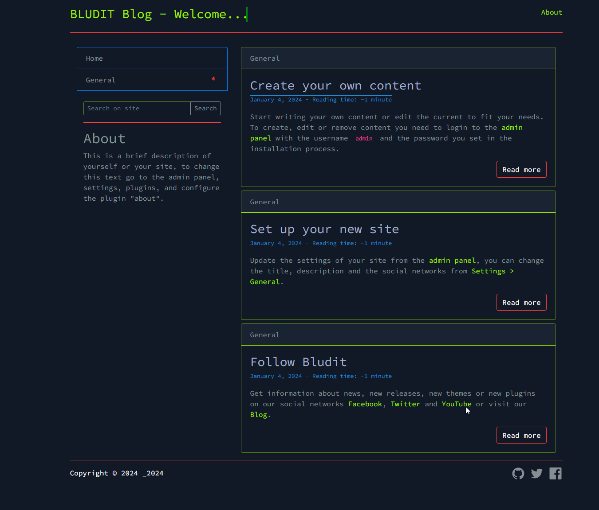

# KOH Terminal Theme - Fork 
made for [Bludit](https://www.bludit.com/)

## Intro
Work is in progress, no reason to use it now, but worth to check ;)

## Install
Asuming you have an existing Bludit installation in your Webroot, go to `bl-themes` and clone this repo.

```
git clone https://github.com/sirdree/koh_terminal_bludit_theme.git
```
or you can use the original source from here:

```
git clone https://git.koh.cloud/fuchs/koh_terminal.git
```

Setup the correct permission on `koh_terminal_bludit_theme`, like 

```
sudo chown -R www-data:www-data koh_terminal_bludit_theme
```

Now you're able to activate the Theme in the `/admin` Area.


## Screenshot
